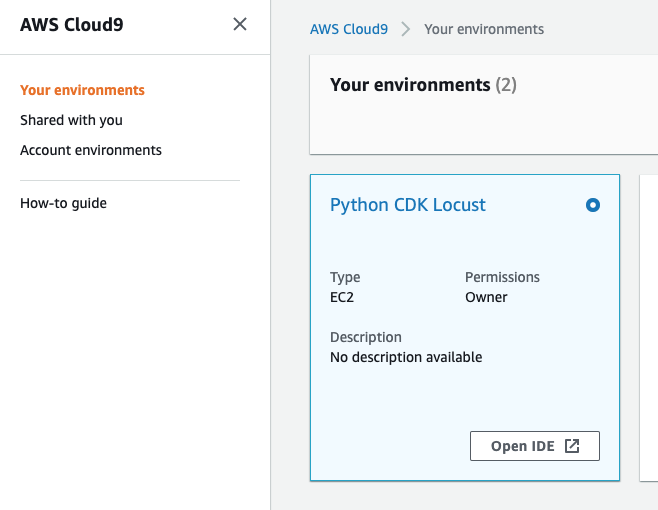
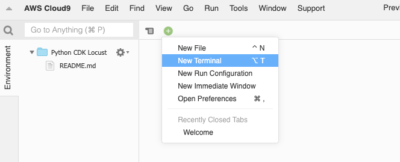
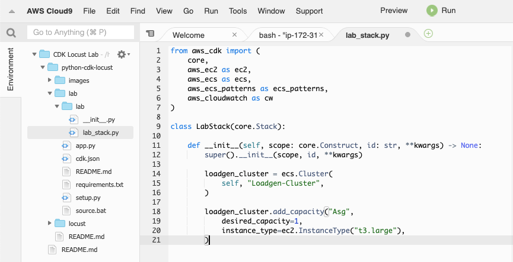

# Deploy a Locust load generator in ECS using CDK Python 

This lab walks you through creating a CDK project in Python that will implement 
an ECS Service running [Locust.io](https://locust.io/). Using CDK constructs 
we'll create a customised Locust container image and all supporting service configuration, including: VPC, 
ECS cluster, ECS Service, Application Load Balancer, and a CloudWatch dashboard.

## How much will this lab cost?
Base costs will be ( $USD in ap-southeast-2):
* Cloud9 and Locust instances $0.0132 per Hour each. 
* NAT Gateway $0.059 per Hours plus $0.059 per GB processed.
* Elastic Container Registry - Container storage
* S3 - Used by CDK to store intermediate objects that CDK creates 

* You will need to manually delete resources in S3 and ECR after the lab *

However, if you're eligible for [Free Tier](https://aws.amazon.com/free) and 
you select t3.micro instance type, your Cloud9 and Locust instances will be free. 

If you use the results of this lab to load test a website outside of your own 
VPC, keep in mind that the charge for data processed through NAT Gateway can 
become quite substantial during a load test. 

## Step 0: Getting Started

In order to run this lab, you'll need a development environment with Python3 and
CDK installed, and your AWS account bootstrapped for CDK. If you already have this,
please skip to Step 1.

First, open the Cloud9 console in the region in which you will complete this lab
and create a new Environment, give it an appropriate name and hit "Next Step"


On the next page, select your instance size, keeping in mind that larger instance 
types will have a cost associated with them. Then hit "Next Step"


Then review your settings and hit "Create Environment"

Once your Cloud9 development environment is created, it will open the IDE. 
Whenever you need to get back into your IDE, just go to the Cloud9 console, and
click "Open IDE" on your Environment. 




Cloud9 comes with Python3 and CDK installed by default!


## Step 1: Clone lab resources and Initialise a CDK project


Open a terminal tab in Cloud9 by clicking the + and selecting New Terminal




1. clone the lab resources into a local directory.
```
git clone https://github.com/tynooo/python-cdk-locust
```
This will create a local copy of this repository that includes this README, and 
the Dockerfile and locust test file that we'll use. 


2. Enter the python-cdk-locust directory and create a new directory for your work 
```
cd python-cdk-locust
mkdir lab
cd lab
```
3. Initialise your CDK project
```
cdk init --language python
```
This builds the base directory structure for your project, it must be run in an
empty directly or it will fail. Some important files:
 * app.py - The entry point for you app, it defines your environment  and the 
stack(s) that will be created
 * requirements.txt - Library dependencies for your Python code, in this case 
the CDK libraries that we will use
 * lab/lab.py - The file that defines the CDK stack

You can learn more about CDK from this 
[Blog post](https://aws.amazon.com/blogs/developer/getting-started-with-the-aws-cloud-development-kit-and-python/)
or from the [CDK Developer Guide](https://docs.aws.amazon.com/cdk/latest/guide/home.html)

 
## Step 2: Set the region that our stack will deploy into
Open the app.py file in Cloud9, and add an environment paramater to the stack
instantiation. If you're deploying into a different account, you can set that 
here too with the "account" property.
```
LabStack(app, "lab",
    env={'region': 'ap-southeast-2'}
)
```
**Remember: Save your files after each step!**

## Step 3: Define your python dependencies
Open the file named requirements.txt in your lab directory, replace the contents with 
the following, and save it. This file defines the Python libraries that our 
lab will use. 
```
aws-cdk.core
aws-cdk.aws_ec2
aws-cdk.aws_ecs
aws-cdk.aws_ecs_patterns
aws-cdk.aws_cloudwatch
```
Open your CDK Stack lab/lab_stack.py in Cloud9 and replace the first line with the following
to import the CDK libraries.

```
from aws_cdk import (
    core,
    aws_ec2 as ec2,
    aws_ecs as ecs,
    aws_ecs_patterns as ecs_patterns,
    aws_cloudwatch as cw
)
```


# Let's Build!

In CDK there are 3 levels of construct:
1. CFn Resources - These are constructs which are created directly from 
CloudFormation and work in the same way as the CloudFormation resource 
they're based upon, requiring you to explicitly configure all resource 
properties, which requires a complete understanding of the details of the 
underlying resource model.
2. AWS Constructs - The next level of constructs also represent AWS resources, 
but with a higher-level, intent-based API. AWS Constructs offer convenient 
defaults and reduce the need to know all the details about the AWS resources they represent.
3. Patterns - These constructs are designed to help you complete common tasks in 
AWS, often involving multiple kinds of resources.

You can find more information on CDK constructs in the CDK Developer Guide - 
[Constructs](https://docs.aws.amazon.com/cdk/latest/guide/constructs.html)

In this lab we'll be using a Pattern from the ecs_patterns class
called ApplicationLoadBalancedEc2Service. However, we'll create the ECS cluster
independently of the Pattern.


## Step 4: Create an ECS Cluster

*All code changes for the rest of the lab will be done in the file lab/lab_stack.py*

Create an ECS cluster and add an instance to it. If we had specific requirements
around the VPC configuration, we could have created a fresh one first, and passed
it to the ECS cluster via the ```vpc``` parameter. Instead, we'll just let the 
ECS Cluster construct create it for us.


```
        loadgen_cluster = ecs.Cluster(
            self, "Loadgen-Cluster",
        )
        
        loadgen_cluster.add_capacity("Asg",
            desired_capacity=1,
            instance_type=ec2.InstanceType("t3.micro"),
        )
        
```



As you progress, you can test that your code generates valid CloudFormation by 
running ```cdk synth``` But before you do this, you need to activate your python 
virtualenv and install your dependencies. 

```
source .env/bin/activate
pip3 install -r requirements.txt
```

***Remember:Every time you work on your CDK project, you'll need to activate your virtualenv***

If you haven't used CDK in this account before, run ```cdk bootstrap``` to prepare
your account. This will create an S3 bucket to store a small amount of CDK resources.

It should look like this:
```
(.env) admin:~/environment/python-cdk-locust/lab (master) $ cdk bootstrap
   Bootstrapping environment aws://<account-id>/ap-southeast-2...
CDKToolkit: creating CloudFormation changeset...
 0/3 | 4:57:10 AM | CREATE_IN_PROGRESS   | AWS::S3::Bucket       | StagingBucket 
 0/3 | 4:57:12 AM | CREATE_IN_PROGRESS   | AWS::S3::Bucket       | StagingBucket Resource creation Initiated
 1/3 | 4:57:34 AM | CREATE_COMPLETE      | AWS::S3::Bucket       | StagingBucket 
 1/3 | 4:57:36 AM | CREATE_IN_PROGRESS   | AWS::S3::BucketPolicy | StagingBucketPolicy 
 1/3 | 4:57:37 AM | CREATE_IN_PROGRESS   | AWS::S3::BucketPolicy | StagingBucketPolicy Resource creation Initiated
 2/3 | 4:57:37 AM | CREATE_COMPLETE      | AWS::S3::BucketPolicy | StagingBucketPolicy 
 3/3 | 4:57:39 AM | CREATE_COMPLETE      | AWS::CloudFormation::Stack | CDKToolkit 
   Environment aws://<account-id>/ap-southeast-2 bootstrapped.
```


Now run ``` cdk synth``` to synthesize your CloudFormation template. You should 
see a CloudFormation template several hunderd lines long defining your ECS 
cluster and its dependecies. This should take about 5 minutes to complete. 

If you only see a metadata resource, you've forgotten to save you lab_stack.py file.


```
(.env) admin:~/environment/python-cdk-locust/lab (master) $ cdk synth
Resources:
  LoadgenCluster881F169E:
    Type: AWS::ECS::Cluster
    Metadata:
      aws:cdk:path: lab/Loadgen-Cluster/Resource
  LoadgenClusterVpc73B88059:
    Type: AWS::EC2::VPC
    Properties:
      CidrBlock: 10.0.0.0/16
      EnableDnsHostnames: true
      EnableDnsSupport: true
      InstanceTenancy: default
      Tags:
        - Key: Name
          Value: lab/Loadgen-Cluster/Vpc
...
```

You can now deploy your template by running ```cdk deploy``` 


## Step 5: Create a container and task definition

Now that we've got our ECS cluster, we need something to run on it. We'll start 
by defining a task definition
```
        task_def = ecs.Ec2TaskDefinition(self, "locustTask",
            network_mode=ecs.NetworkMode.AWS_VPC
        )
```

Now we'll add a container to run in our task. This container definition creates 
a new container image based on a DOCKERFILE which references the official Locust.io 
image on Dockerhub and accompanying locust.py file in the ```/locust``` directory. 
CDK will then upload this to an ECR repository that it creates automatically.

We also set the environment variables that Locust requires to initialise here.

```
        locust_container = task_def.add_container(
            "locustContainer",
            image=ecs.ContainerImage.from_asset("../locust"),
            memory_reservation_mib=512,
            essential=True,
            logging=ecs.LogDrivers.aws_logs(stream_prefix="cdkLocust"),
            environment={"TARGET_URL": "127.0.0.1"}
        )
        locust_container.add_port_mappings(ecs.PortMapping(container_port=8089))
```


## Step 6: Define a service

Now that we've created all of the underlying components, it's time to put them
together into a service and run it on our ECS cluster. For this we'll use an ECS
Pattern construct which not only creates the service, but automatically puts it 
behind an Applicaion Load Balancer for us. 
```
        locust_service = ecs_patterns.ApplicationLoadBalancedEc2Service(self, "Locust", 
            memory_reservation_mib=512, 
            task_definition=task_def, 
            cluster=loadgen_cluster
        )
```


As we're using a Pattern, that's all that is required, as CDK uses the pattern to 
take care of the rest of the details. 

Run ```cdk diff``` to see what changes this will make to the CloudFormation that CDK
will generate and deploy.

Now deploy your stack using ```cdk deploy``` - it should take about 5 minutes to 
deploy. When that completes, in a web browser go to the LocustServiceURL which 
is output at the end of the deploy process. You should see your Locust load 
generator page.

You can test this by entering your LocustServiceURL in the host field, and 1 
for the number of users and hatch rate (Don't set it too high or you'll DoS 
your instance!)


## Oops! We need a bigger instance!

Imagine having just discovered that the t3.micro instance we selected for our ECS
cluster isn't adequate to handle the load we're generating. We need to move to a
C5.large instance.

With CDK, this is easy. Simply change the ```t3.micro``` in your ecs cluster to
```c5.large``` save the file, and redeploy with ```cdk deploy```.

## Monitoring
Obviously, just having our service running is not enough, we need to monitor its
operation. Let's create a simple CloudWatch Dashboard to monitor a couple of 
metrics for our service. 

Again, we can take advantage of the abstractions built into the CDK constructs. 
We'll build a new dashboard and add graph widgets for both the ECS cluster and 
ALB.Start by creating the graph widgets based on metric objects which are properties
of our ECS Cluster and ALB 

```
        ecs_widget = cw.GraphWidget(
            left=[locust_service.service.metric_cpu_utilization()], 
            right=[locust_service.service.metric_memory_utilization()],
            title="ECS Service - CPU and Memory Reservation"
        )
            
        alb_widget = cw.GraphWidget(
            left=[locust_service.load_balancer.metric_request_count()],
            right=[locust_service.load_balancer.metric_processed_bytes()],
            title="ALB - Requests and Throughput"
        )
```

Now, we'll add them to a dashboard

```
        dashboard = cw.Dashboard(self, "Locustdashboard")
        dashboard.add_widgets(ecs_widget)
        dashboard.add_widgets(alb_widget)
```

Save your file, and deploy the changes using ```cdk deploy```

After a couple of minutes, when that's finished deploying, go to your CloudWatch 
console, click "Dashboards" on the left, the click the dashboard starting with 
"Locustdashboard". You should now see the graphs you just created.


## Cleanup

Cleaning up in CDK is easy! Simply run ```cdk destroy``` and CDK will delete 
all deployed resources.

Delete your Cloud9 environment by going to the Cloud9 console, select your 
environment, click the Delete button, and follow the prompts. 

If you no longer intend to use CDK in your account, you can also delete your 
bootstrap resources by going to the CloudFormation console and deleting the
CDKToolkit stack.
